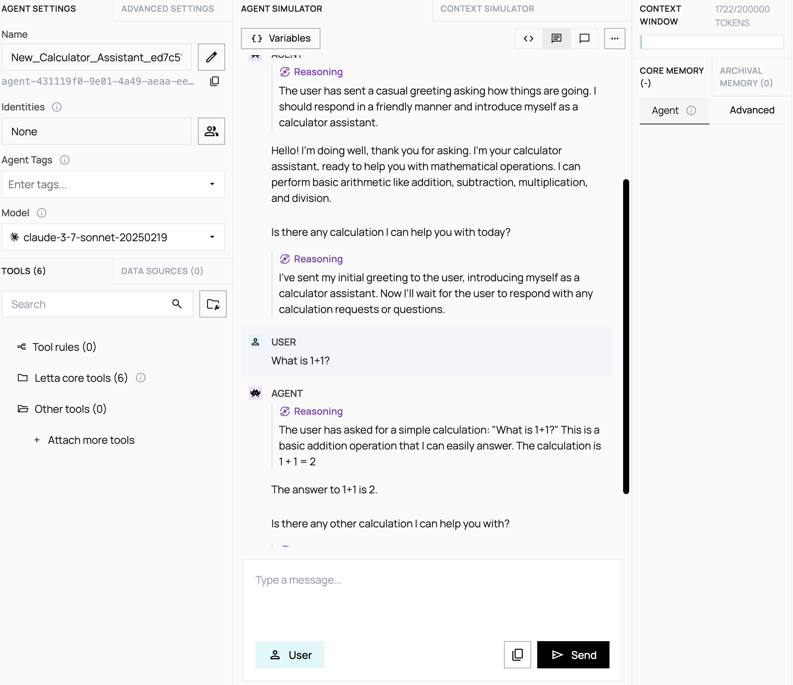

# Letta Calculator Agent Setup Guide

This guide will help you set up a `Letta` server and create a calculator agent with custom tools.

## What is Letta?

`Letta` is an open-source platform for building stateful AI agents that maintain memory and context across conversations. Unlike traditional LLM applications, `Letta` agents can:

1. Maintain persistent memory and learn from past interactions

1. Manage context intelligently to optimize LLM performance

1. Integrate with custom tools and data sources

1. Run as autonomous services with their own APIs

### Prerequisites

1. Docker installed on your system

1. Python 3.11+ with pip

1. AWS or Anthropic API credentials (for model access)

### Getting Started

1. Start the `Letta` Server

Run the `Letta` server using Docker with your API credentials:

```bash
    # For using Anthropic models directly
    docker run \
    -v ~/.letta/.persist/pgdata:/var/lib/postgresql/data \
    -p 8283:8283 \
    -e ANTHROPIC_API_KEY='your-anthropic-api-key' \
    letta/letta:latest

    # For using AWS Bedrock
    docker run \
    -v ~/.letta/.persist/pgdata:/var/lib/postgresql/data \
    -p 8283:8283 \
    -e AWS_ACCESS_KEY_ID="your-aws-access-key" \
    -e AWS_SECRET_ACCESS_KEY="your-aws-secret-key" \
    -e AWS_REGION="us-west-2" \
    letta/letta:latest
```

2. Set up the Python Environment

Create and activate a virtual environment, then install the required packages:

```bash
    curl -LsSf https://astral.sh/uv/install.sh | sh
    export PATH="$HOME/.local/bin:$PATH"
    uv venv && source .venv/bin/activate && uv pip sync pyproject.toml
    UV_PROJECT_ENVIRONMENT=.venv
```

3. Create a Calculator Agent

Create a file named letta_calculator.py with the following content:

```python
    from letta_client import Letta
    import uuid
    import os
    import time

    # Connect to Letta
    client = Letta(base_url="http://localhost:8283")

    # List available models
    available_models = client.models.list_llms()
    print("\nAvailable models:")
    for i, model in enumerate(available_models):
        print(f"{i+1}. {model.handle} ({model.model_endpoint_type})")
    print("\n")

    # Generate unique suffixes for tool names with timestamp
    timestamp = int(time.time())
    unique_suffix = f"{str(uuid.uuid4())[:8]}_{timestamp}"

    # System prompt for the calculator agent
    system_prompt = """SYSTEM PROMPT HERE
    """
    # Create the calculator tool with source code
    calculator_source_code = """ SOURCE CODE HERE
    """
    # Add a descriptor to the json_schema to include a name for the tool
    tool_schema = {
        "name": f"calculator_tool_{unique_suffix}",
        "description": "A tool that performs basic arithmetic operations",
        "type": "function"
    }

    # Create the calculator tool
    calculator_tool = client.tools.create(
        source_code=calculator_source_code,
        description=f"Calculator Tool {unique_suffix}",
        source_type="python",
        tags=["math", "calculator"],
        json_schema=tool_schema
    )

    print(f"Created calculator tool with ID: {calculator_tool.id}")

    # Choose an appropriate model from the list
    # Default to claude-3.5-sonnet if available
    model_to_use = "anthropic/claude-3.5-sonnet"

    # Create LLM config
    llm_config = {
        "model": model_to_use,
        "temperature": 0.7,
        "max_tokens": 1000,
        "put_inner_thoughts_in_kwargs": False,
        "model_endpoint_type": "anthropic",
        "context_window": 200000
    }

    # Create embedding config
    embedding_config = {
        "model": "openai/text-embedding-ada-002",
        "embedding_endpoint_type": "openai",
        "embedding_model": "text-embedding-ada-002",
        "embedding_dim": 1536
    }

    # Create the agent
    agent = client.agents.create(
        name=f"Calculator_Assistant_{unique_suffix}",
        description="An assistant that can perform mathematical calculations",
        system=system_prompt,
        memory_blocks=[],
        tools=[calculator_tool.id],
        llm_config=llm_config,
        embedding_config=embedding_config
    )

    print(f"Created calculator agent with ID: {agent.id}")
    print("Agent created successfully!")
```

4. Run the Script

Execute the script to create your calculator agent:

```bash
    python letta_calculator.py
```

This will:

1. List all available models
1. Create a calculator tool with a unique identifier
1. Create an agent that can use this tool

### Access Your Agent
You can access your agent in several ways:

1. Through the Agent Development Environment (ADE). Once you spin upn your docker container, it will start a local server with the ADE:

Open a web browser and go to http://localhost:8283/ade
Find your agent in the list and click to interact with it

2. Using the Letta API:

Send messages to your agent using the Letta client
Create a new file `interact_with_agent.py`:

```python
    from letta_client import Letta

    # Connect to Letta
    client = Letta(base_url="http://localhost:8283")

    # Replace with your agent ID from the previous step
    agent_id = "agent_id_here"

    # send a message to the agent
    response = client.agents.messages.create(
        agent_id=agent_id,
        messages=[
            {
                "role": "user",
                "content": "What is 1+1?"
            }
        ]
    )
```

## How to export/import agents?

**IMPORTANT**: If you want to change your agent, export your agent on the Agent Development Environment (ADE) as a `.af` file. **Agent File (.af)** is an open standard file format for serializing stateful AI agents. Originally designed for the Letta framework, Agent File provides a portable way to share agents with persistent memory and behavior. Change the contents/add content and import the updated `.af` file on the ADE. This will create a new agent which persists memory from the previous memory and you can test it with the latest updates too. 

## View an example: 



```json
    {
    "created_by_id": "user-00000000-0000-4000-8000-000000000000",
    "last_updated_by_id": "user-00000000-0000-4000-8000-000000000000",
    "created_at": "2025-04-07T19:42:14.309997Z",
    "updated_at": "2025-04-07T19:42:14.362861Z",
    "id": "message-c5176f81-4e37-4614-97c0-28aad3f46f29",
    "role": "assistant",
    "content": [
      {
        "type": "text",
        "text": "\nI've answered the user's question about what 1+1 equals (2). Now I'll wait to see if they have any other calculations they'd like me to perform.\n"
      }
    ],
    "organization_id": "org-00000000-0000-4000-8000-000000000000",
    "agent_id": "agent-431119f0-9e01-4a49-aeaa-eea9b64153cc",
    "model": "claude-3-7-sonnet-20250219",
    "name": "New_Calculator_Assistant_ed7c51ca",
    "tool_calls": [],
    "tool_call_id": null,
    "step_id": "step-e0101de7-0c58-4e28-a54c-bc8f152f55c0",
    "otid": null,
    "tool_returns": [],
    "group_id": null
  }
```

## View the `.af` file:

You can use the `.af` file as an example to export, make changes to the agent and import it. **Agent File (.af)** is an open standard file format for serializing stateful AI agents. Originally designed for the Letta framework, Agent File provides a portable way to share agents with persistent memory and behavior.

Agent Files package all components of a stateful agent: system prompts, editable memory (personality and user information), tool configurations (code and schemas), and LLM settings. By standardizing these elements in a single format, Agent File enables seamless transfer between compatible frameworks, while allowing for easy checkpointing and version control of agent state.

View an example here: [`.af file`](New_Calculator_Assistant_ed7c51ca.af)
