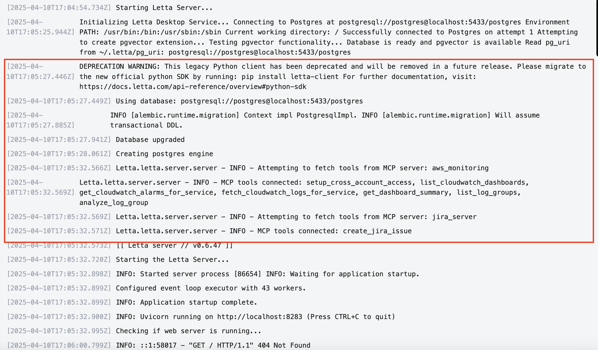
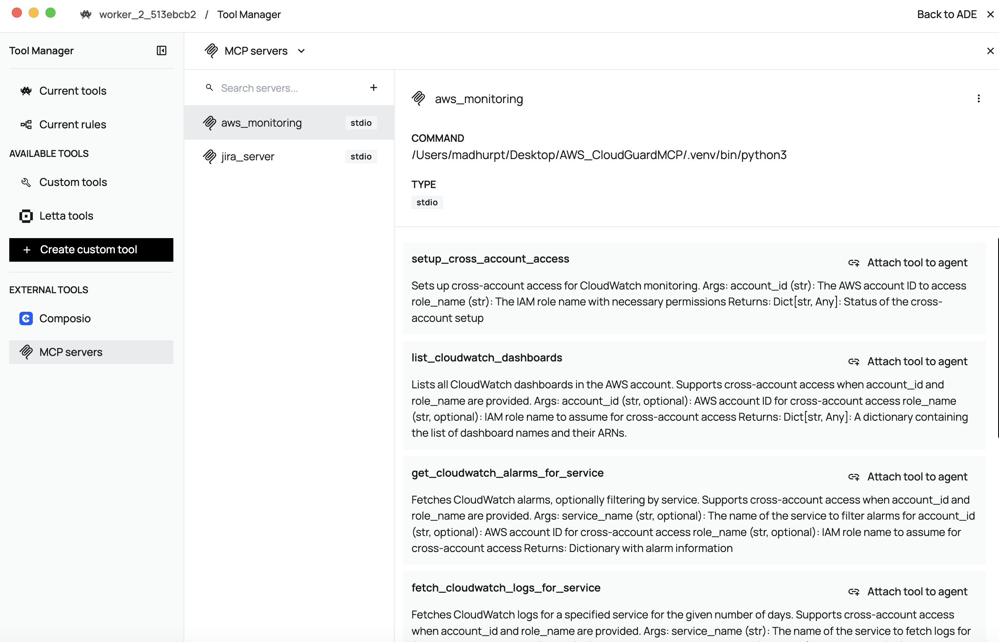

# Use Model Context Protocol (MCP) with Letta

The primary way to use MCP is to install an MCP server locally. [this documentation is fetched from the [Letta](https://docs.letta.com/guides/mcp/stdio#step-3-start-the-letta-server) website.]

When you run an MCP server locally, the MCP client will read the instructions on how to launch the server (the command to run) the MCP config file, then launch the server in a `subprocess` - so technically the client is running the server.

## Connecting local MCP servers to a Letta server in Docker
Local MCP servers pose an issue for Docker - since the MCP client (Letta) will attempt to start the MCP server using the command specified in the config, and because the Letta server is running inside of Docker, that means that the config file needs to specify a command that can be run inside of Docker.

## There are three ways to solve this problem (in order of increasing difficulty):

1. **Use Letta Desktop**. Letta Desktop runs a Letta server locally (not inside of Docker), so it will be able to run the command specified in the MCP config file to start the MCP server.

2. **Don’t use a local MCP server**, instead use an MCP server that uses the SSE protocol (see instructions below on conecting Letta to a remote MCP server).

3. **Run an MCP SSE proxy to turn your local MCP server into a remote one**. This example repo shows you how to run an MCP proxy to turn a local MCP server into a remote / SSE MCP server. If you follow this route, you will need to make sure you expose to appropriate ports during docker run to enable the Letta server to reach the MCP server URL.

4. **Install the MCP server inside the Docker container** (e.g. at run-time via docker exec). If you install the MCP server inside the Docker container, the MCP client inside the Letta server will be able to execute the command specified in the config file. However, we don’t recommend this approach since the MCP server will need to be reinstalled on each restart.

## Steps to set up

1. **Set up your MCP environment variables**: In this example, we have configured the config environment variables in `~.letta/mcp_config.json` as follows:

    ```bash
    {
    "mcpServers": {
        "aws_monitoring": {
        "command": "",
        "args": [
            ""
        ],
        "env": {
            "AWS_ACCESS_KEY_ID": "",
            "AWS_SECRET_ACCESS_KEY": "",
            "AWS_REGION": "",
            "BEDROCK_LOG_GROUP": "",
            "MCP_TRANSPORT": ""
        }
        },
        "jira_server": {
        "command": "",
        "args": [
            ""
        ],
        "env": {
            "JIRA_API_TOKEN": "",
            "JIRA_USERNAME": "",
            "JIRA_INSTANCE_URL": "",
            "JIRA_CLOUD": "",
            "PROJECT_KEY": "",
            "MCP_TRANSPORT": ""
        }
        }
    }
    }
    ```

2. Clone the repository and create docker containers for each server:


    ```bash
    cd letta-mcp-workflow
    git clone https://github.com/madhurprash/AWS_CloudGuardMCP.git
    cd AWS_CloudGuardMCP/
    docker build -t aws-cloudguard-mcp .
    docker build -t aws-jira-mcp .
    ```

3. Open your `Letta` desktop application: You can now view `MCP servers` for each agent and associate an MCP server/tools to an agent:

View the servers being connected in the Letta terminal:



View the MCP servers:


