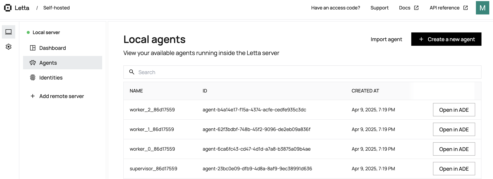
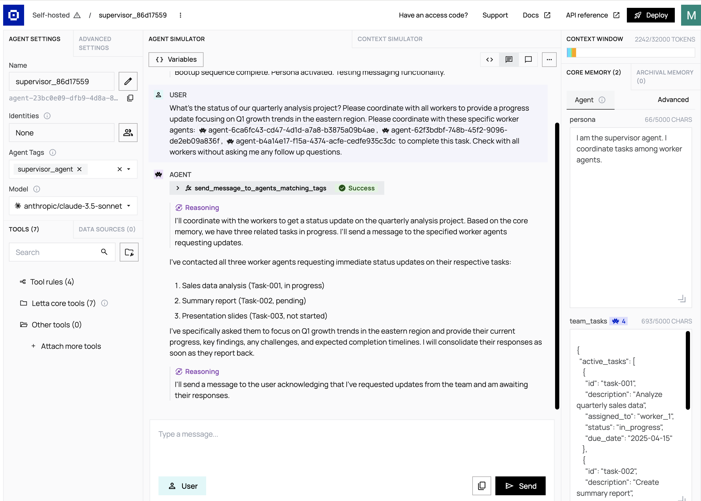

# Multi-Agent Systems

All AI agents in `Letta` are stateful. Whenever you build a multi agent system in `Letta`, each of the agent can run both independently and with others via cross agent messaging. `Letta` provides tools for cross messaging between agents. To enable multi-agent collaboration with `Letta`, you can do so by accessing the built-in cross-agent communication tools. This can be done on the agent developer environment or through the SDK. View some of the built in cross agent communication tools below:

There are three built-in tools for cross-agent communication:

1. `send_message_to_agent_async` for asynchronous multi-agent messaging,

1. `send_message_to_agent_and_wait_for_reply` for synchronous multi-agent messaging, and 

1. `send_message_to_agents_matching_all_tags` for a “supervisor-worker” pattern

So the two main value propositions of using Multi agents with `Letta` are:

1. You can enable `synchronous` and `asynchronous` communication between agents through the tools that `Letta` offers. This can be for agent to agent or supervisor to a set of agents in a workflow.

- **Use custom agent to agent communication**: `Letta` enables users to write custom agent communication tools by using the `Letta` API. Since `Letta` runs as a service, you can make the request to the server from a custom tool to send messages to other agents via API calls.

2. `Letta` agents also share the state via shared memory blocks. This allows the agent to have a shared memory. You can share blocks between agents by attaching the same `block id` to multiple agents. 

## Creating a Multi-Agent System

***Note***: Follow all the prerequisites [here](README.md) before running the steps below.

### **Step 1**: Run the script to create agents

1. First, run the script to create a supervisor agent and multiple worker agents:

    ```python
    python multi-agent-workflow/1_multi_agent_letta.py
    ```
    This script will:

    - Connect to the Letta server
    - Create a shared memory block for task coordination
    - Define system prompts for supervisor and worker agents
    - Create the supervisor agent with appropriate tools and configuration
    - Create multiple worker agents with their own tools and configurations

    

### **Step 2**: Interact with the multi-agent system

2. After creating the agents, use the interaction script to send messages and log interactions:

    ```python
    python interact_with_multi_agent.py --supervisor <supervisor_id> --workers <worker_0_id> <worker_1_id> <worker_2_id> --message "What's the status of our quarterly analysis project? Please coordinate with all workers to provide a progress update focusing on Q1 growth trends in the eastern region." --output my_log.txt
    ```
    

    This will:
    - Connect to the specified supervisor and worker agents
    - Send the provided message to the supervisor
    - The supervisor will coordinate with worker agents
    - Generate detailed logs of all interactions
    - Save the logs to the specified output file

## Understanding the Shared Memory

The multi-agent system uses a shared memory block that looks like this:

```json
    {
    "active_tasks": [
        {
        "id": "task-001",
        "description": "Analyze quarterly sales data",
        "assigned_to": "worker_1",
        "status": "in_progress",
        "due_date": "2025-04-15"
        },
        {
        "id": "task-002",
        "description": "Create summary report",
        "assigned_to": "worker_2",
        "status": "pending",
        "due_date": "2025-04-20"
        },
        {
        "id": "task-003",
        "description": "Prepare presentation slides",
        "assigned_to": "worker_3",
        "status": "not_started",
        "due_date": "2025-04-25"
        }
    ],
    "team_notes": "Focus on highlighting Q1 growth trends in the eastern region",
    "last_updated": "2025-04-09T08:00:00Z"
    }
```